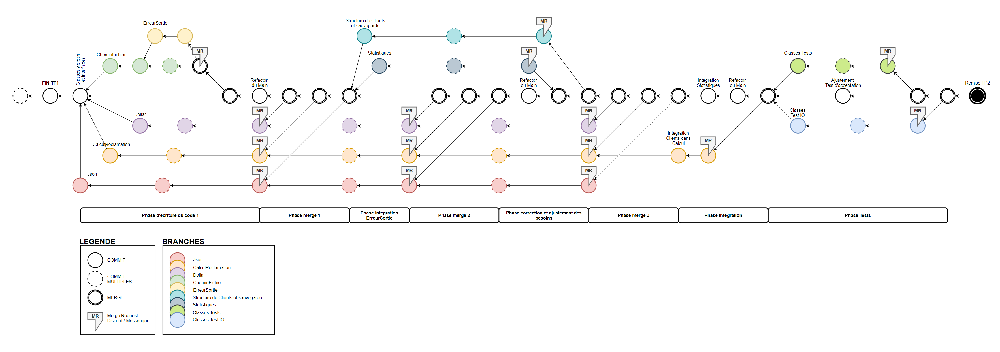
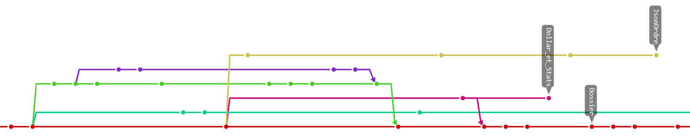
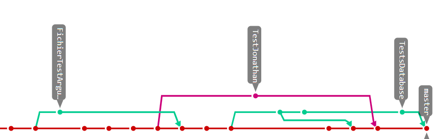
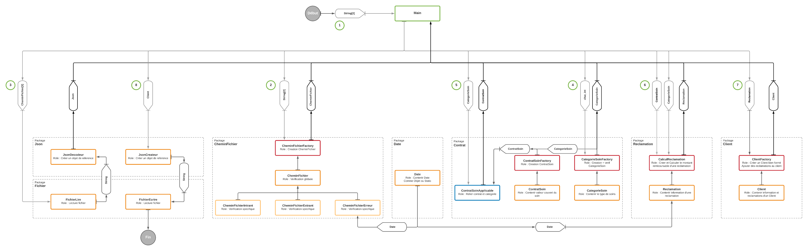
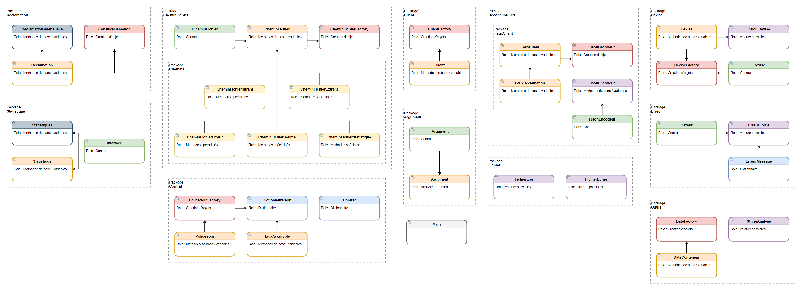
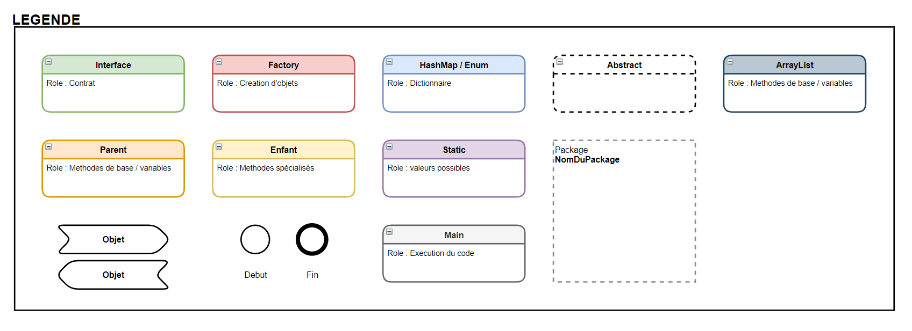

# WORKFLOW PLANIFIÉ
  
voir `doc/INF2050 TP2 schema.drawio` ou `doc/workflow.png`

## WORKFLOW RÉEL
### Phase d'ecriture du code 1
  
Des changements lors de la repartition des tâches ont résultés en des branches non merge au master. Cette décision était pour apporter un oeuil différent aux problèmes rencontrés par des coéquipiers afin de ne pas rester pris sur le même problème durant tout le travail. Le nouveau code écrit aurrait du se trouver dans une branche, mais il a été inclus dirrectement dans le master.  

### Phase de Tests
  
La phase de test était beaucoup plus facile à suivre puisque le travail est plus machinal. Les merge supplémentaires étaient dans le but d'évaluer la couverture total des deux branches de tests. 

## REPARTITION DES CLASSES
Afin d'assurer la responsabilité unique des classes, le code a été divisé selon le schema suivant au `TP1` (présentant aussi les interraction des classes).  
  
voir `doc/INF2050_TP1_schema.png`

Le même travail a été effectué au départ du `TP2`, mais sans les relations, afin de planifier le `workflow` et les tâches à effectuer. 
  
  
voir `doc/INF2050_TP2_schema.png` et `doc/INF2050_TP2_schema_legende.png`

La majorité des interfaces n'ont pas été implementés par manque de nécessité. 